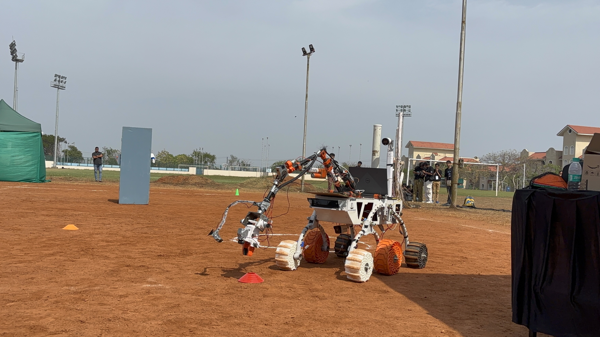
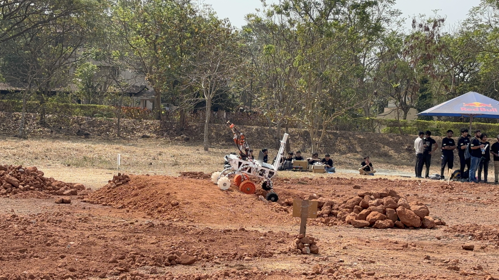
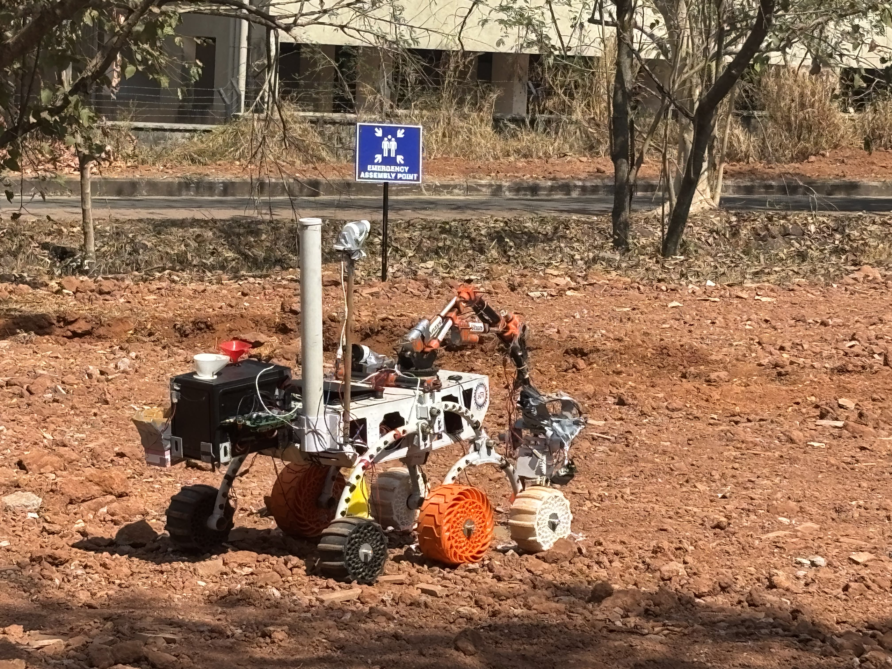
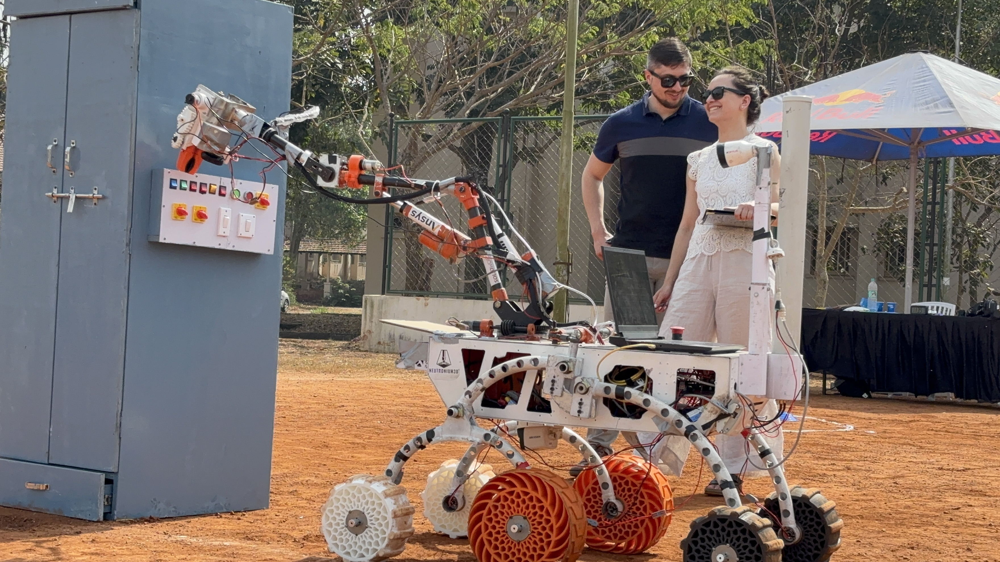

# Mars Rover Project

## 📌 Overview
This repository showcases the development and implementation details of our **Mars Rover prototype**, designed for **autonomous and manual operations** in challenging terrains. The rover is built to perform **scientific analysis, object detection, and autonomous navigation** using advanced hardware and software integrations.

  

## 🚀 Key Components
### 🔹 Autonomous Stack
- **Object Detection & Soil Classification:** Deep learning models trained for object detection and soil classification.
- **Navigation System:** Scripts to control the rover’s autonomous movement, obstacle avoidance, and path planning.
- **Sensor Integration:** GPS and IMU data collected via an Arduino module, processed in Python for real-time navigation.
- **Arrow Detection:** Uses OpenCV and mathematical calculations to determine arrow orientation and direction for navigation.

### 📷 Cameras
- Python scripts to display **IP camera feeds**.
- ROS launch files to initialize **USB cameras**.

### 🤖 Deep Learning Models
- A dedicated folder contains all **deep learning models**, including those for **object detection and soil classification**.

### 🛠️ Microcontrollers
- **Arm Control:** ESP code to manage robotic arm movements.
- **Drive Control:** ESP code for manual driving operations.
- **Sensor Data:** Arduino scripts for publishing and subscribing science sensor data via ROS topics.
- **Wireless Communication:** Utilizes a **2.4GHz antenna** for stable data transmission between the rover and the base station.

### 🏎️ ROS Nodes
- **Arm Nodes:** Publish joystick values to control the robotic arm.
- **Drive Nodes:** Publish joystick values for manual driving.
- **Test Scripts:** Simulated scripts to display system behavior when publishing specific values without running the rover.

### 🔬 Science Module
- **Graphing Tools:** Real-time visualization of science sensor data.
- **Camera Launch for Science Missions:** ROS launch file to activate cameras for scientific analysis.
- **Sensor Data Handling:** Scripts to manage science sensor data publishing and subscribing via ROS.
- **Soil Classification:** GUI-based Python tool to infer results from the trained soil classification model.

## 🌟 Features
✅ **Six-Wheel Drive:** Optimized for various terrains, ensuring stability and mobility.  
✅ **6-DOF Robotic Arm:** Capable of precise object manipulation and soil sample collection.  
✅ **Autonomous & Manual Operation:** Operates independently or via remote control.  
✅ **ROS Framework:** Uses the Robot Operating System (ROS) for efficient communication between components.  
✅ **Jetson Nano Computing Unit:** Handles real-time processing for object detection and navigation.  
✅ **Kinect v2 Depth Sensor:** Enables obstacle detection, terrain mapping, and object recognition.  
✅ **Scientific Assembly:** Equipped with sensors to analyze soil samples for potential signs of life.  
✅ **Wireless Communication:** Uses a **2.4GHz antenna** to maintain communication with the base station over an optimal range.  

## 🛠️ Technologies Used
- **Programming Languages:** Python, C++
- **Hardware Components:** Jetson Nano, Kinect v2, Robotic Arm, Antenna Module, Arduino, ESP32
- **Software Frameworks:** ROS, OpenCV, YOLO, TensorFlow/PyTorch
- **Communication Protocols:** ROS Topics & Services, Serial Communication

## 🔮 Future Enhancements
- **SLAM Integration:** Improve mapping and localization.
- **MoveIt Implementation for Arm:** Implementing MoveIt for advanced motion planning of the robotic arm.
- **MoveBase Implementation for Autonomous Stack:** Integrating MoveBase for improved autonomous navigation and obstacle avoidance.
- **Better Terrain Adaptability:** Enhance wheel design and suspension system.
- **Optimized Power Management:** Increase efficiency for extended missions.
- **AI-Based Decision Making:** Improve navigation and object recognition algorithms.
- **Shifting to ROS 2:** Transitioning the entire stack to ROS 2 for better performance and modularity.
- 
## 📸 Rover Gallery  
Here are some images of our rover in action:  

   
 

## 👥 Contributors
This project is a collaborative effort by the **[Team Inferno DTU]**, a group of passionate engineers and researchers specializing in robotics, AI, and embedded systems.

## 🙌 Acknowledgments
- We extend our gratitude to **[Delhi Technological University]** for providing resources, mentorship, and a platform to develop this project.
- Open-source contributors and ROS community.
